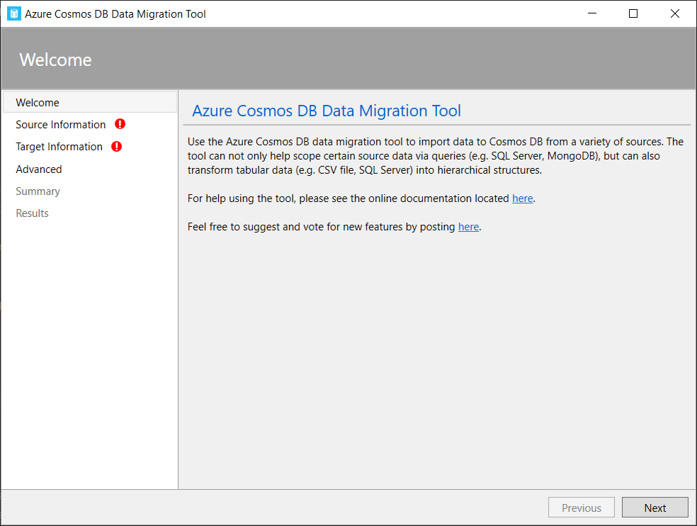
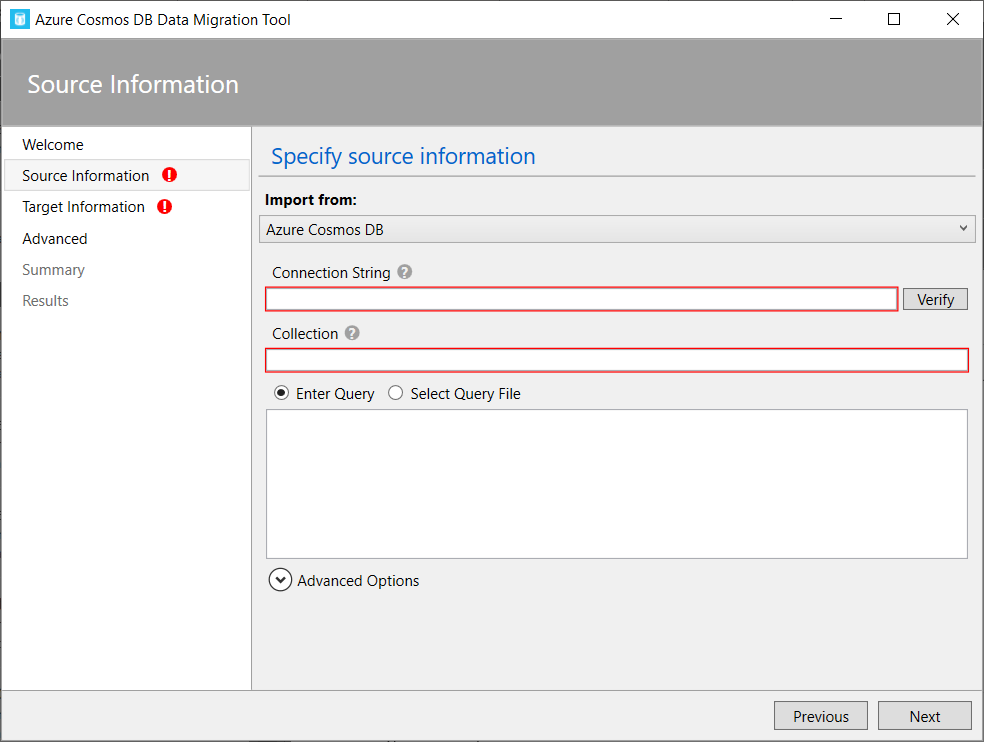
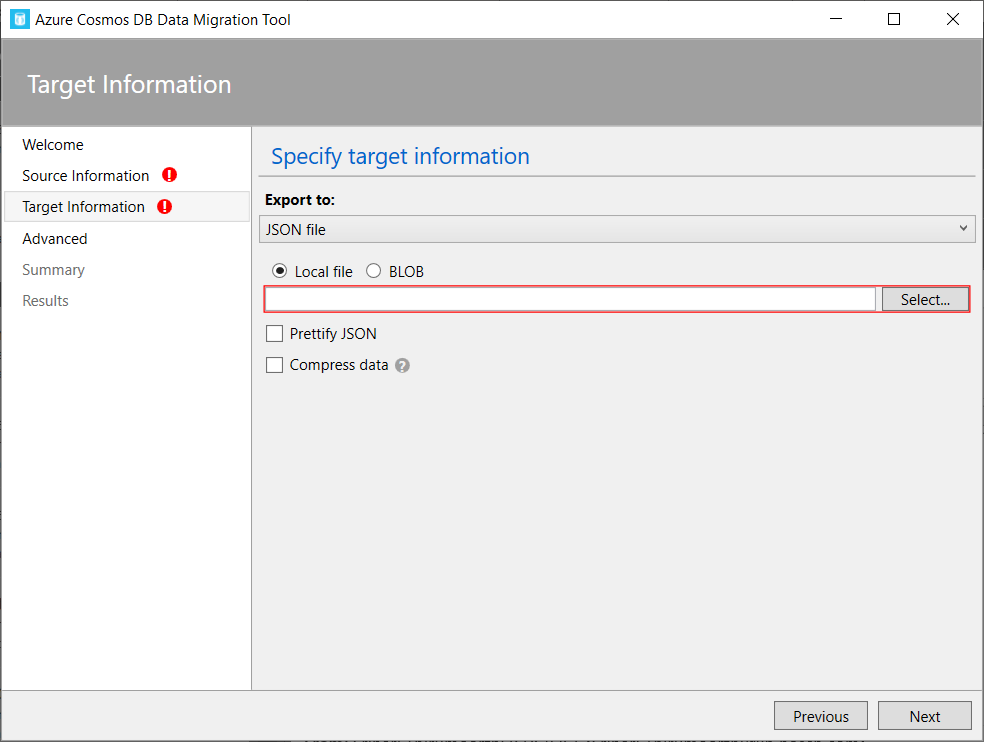
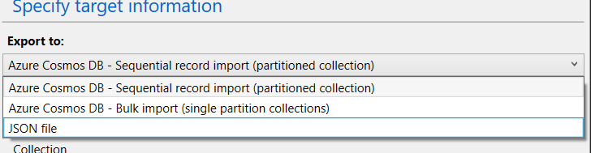

# Migration Utility to migrate from Azure COSMOS DB to Amazon Neptune

## Dependencies:

* Python 3.7+

## Step 1: Export data from Azure COSMOS DB

You can use the Data Migration Tool from Microsoft to export the Cosmos DB dump. Kindly see the steps below:

* Download Data Migration Tool
* Unzip it and run Dtui.exe
    * 
* Select data Source
    * 
* Select Target (Set Export to: JSON file; and check Prettify JSON)
    * 


Please note that the tool provides the below 3 options for exporting
* 


## Step 2: Use cosmos-to-neptune utility to transform and load data inside Amazon Neptune

Once you have the exported json file, update the file path in the utility 

```
filename = 'data/cosmos-dump.json'
````

Before you execute the file, install pandas

```
pip3 install pandas

```

Execute the utility

```
python3 cosmos-to-neptune.py 

```

The utility creates two files, one for nodes and one for edges

Refer [Amazon Neptune bulk load documenation](https://docs.aws.amazon.com/neptune/latest/userguide/bulk-load.html) to load the nodes and edges in Neptune