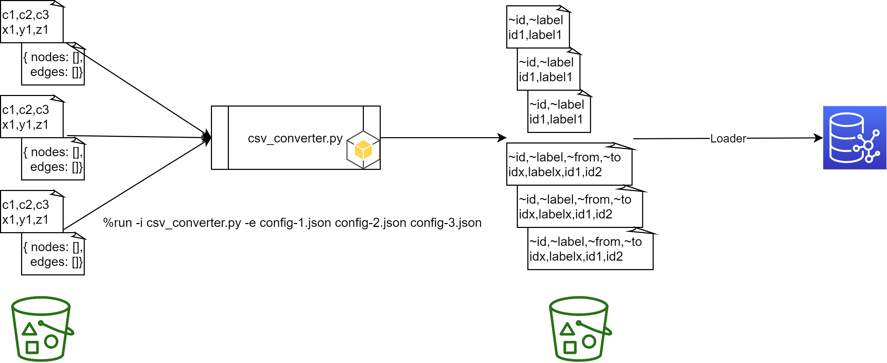

# Introduction

[Amazon Neptune](https://aws.amazon.com/neptune/) provides a [loader endpoint](https://docs.aws.amazon.com/neptune/latest/userguide/load-api-reference.html) that enables bulk data ingestion into the Amazon Neptune database. The loader requires the source data files to be available in a S3 bucket in a particular [load data format](https://docs.aws.amazon.com/neptune/latest/userguide/bulk-load-tutorial-format-gremlin.html).

When customers start their journey with a graph database, the first major hurdle is to identify the nodes and edges in the current data and ingest the data into the graph database. The next step is to improve the nodes and edges design and reload the data into the graph database. Mostly current data is available in a CSV format.

This is a utility to identify nodes and edges in the source CSV data file(s) and generate the Amazon Neptune gremlin load data format files. This script takes a configuration driven approach. A configuration file (JSON) defines the source and target files, nodes/edges definition, and selection logic. The script interprets one or more configuration files and generates Amazon Neptune gremlin load data format files.



`data-config.py` is responsible for interpreting the configuration and applying the configured logic. The logic is independent of the fact that input format is CSV.

`csv-converter.py` is responsible for the `main` and converting the CSV row to python `Dict`.

## Features

This utility has following features:
- Configuration driven approach.
- Supports any number of configuration files as input.
- Each configuration file can have any number of source files to `select` the node/edge from.
- Use S3 or local file system as source and destination of files.
- Automatic duplicate check for nodes/edges based on `uniqueKey`
- Supports multiple encoding.

## Example

Spotify Songs dataset from [rfordatascience/tidytuesday](https://raw.githubusercontent.com/rfordatascience/tidytuesday/master/data/2020/2020-01-21/spotify_songs.csv) is used as an example along with example configuration and Neptune Jupyter notebooks to prepare, load and query the Amazon Neptune database. You can download (right-click on the link and click on save link as..) and copy the dataset in the `.source` folder for testing the example.

## Prerequisites

This utility can be used standalone on your local machine to convert the dataset.  
However, for an integrated experience it is recommended to have an Amazon Neptune environment along with connected Neptune Jupyter notebook and an Amazon S3 bucket.  
You can use the sample data, configuration, and notebooks as the starting point and start building your own configuration file for your dataset.

## Future Enhancements
The current solution can be enhanced further to support:
- RDF load data format as target file(s)
- JSON/XML file formats as source file(s)
- Other databases like Amazon DynamoDB

# Command Line

The solution is presented as a command-line utility.

    py .\csv_converter.py -h
    System File Encoding: cp1252
    usage: csv_converter.py [-h] [-e LOCAL_ENC] [--s3] [--dup] [-v] DATA_CONF_FILE [DATA_CONF_FILE ...]

    Copyright 2018 Amazon.com, Inc. or its affiliates. Licensed under the Apache License 2.0 http://aws.amazon.com/apache2.0/
    positional arguments:
    DATA_CONF_FILE        Space separated, one or more Data Configuration File(s) (json)
                          Use separate files if Node/Edges are different.

    optional arguments:
    -h, --help            show this help message and exit
    -e LOCAL_ENC, --enc LOCAL_ENC
                            Optional: encoding for the source files 'utf-8' or 'cp1252'
    --s3                  Use S3 as source and destination of files
    --dup                 Generate file for duplicates
    -v, --verbose         Emit Verbose logging

    A utility python script to convert CSV data file into the Amazon Neptune CSV format for bulk ingestion. See https://docs.aws.amazon.com/neptune/latest/userguide/bulk-load-tutorial-  
    format-gremlin.html.

# Data Config File

The data config file is where you define source(s), target(s), node(s), and edge(s) definition. The data config file must be a valid JSON file with following fields. See the sample file for clarity.

```
"source_folder" --> Folder (relative to current folder) for source files default is '.source'
"data_folder" --> Folder (relative to current folder) for data files default is '.data'
"s3_bucket" --> S3 bucket name. s3_* fields are required, if --s3 option is used.
"s3_conf_folder" --> S3 folder for config files. 
"s3_source_folder" --> S3 folder for source files.
"s3_data_folder" --> S3 folder for resulting data files.
"fileNames" --> Source csv file names e.g. ["data1.csv", "data2.csv"].
"nodes" --> array of node definitions (see below for Node Definition)
"edges" --> array of edge definitions (see below for Edge Definition)
```

## Node Definition
Node definition is where you define your node.  
It is very important to understand the 'eval' kind of field. The quoted string must be a valid python `eval` statement. `row`, `uuid` and `re` are available for the 'eval' kind of fields.  
For example, `"row['track_artist'] + '-' + row['track_name']"` is the `uniqueKey` for a `Track` node, where:
- `row` points to a row in the CSV file, 
- `'track_artist'` points to the `track_artist` column of the row, 
- the statement is joining two columns to make a `uniqueKey` for the `Track` node.

```
"csvFileName" --> `string` for the output csv file name e.g."Track.csv"
"select" -->  `eval` for the select condition e.g. "'track_name' in row and 'track_artist' in row and row['track_name'] != '' and row['track_artist'] != ''"
"id" --> `eval` for the 'id' of the node e.g. "row['track_artist'] + '-' + row['track_name']"
"label" --> `eval` for the 'label' of the node e.g. "'Track'"
"uniqueKey" --> `eval` for the unique key of the node e.g. "row['track_artist'] + '-' + row['track_name']", if not specified "id" is used.
"properties" --> array of property definitions
```

## Edge Definition

Edge definition is where you define your edge.  
It is very important to understand the 'eval' kind of field. The quoted string must be a valid python `eval` statement. `row`, `uuid` and `re` are available for the 'eval' kind of fields.

```
"csvFileName" --> `string` for the output csv file name e.g."Track_Album_Edges.csv"
"select" -->  `eval` for the select condition e.g. "'track_name' in row and 'track_artist' in row and row['track_name'] != '' and row['track_artist'] != '' and 'track_album_id' in row and row['track_album_id'] != ''"
"id" --> `eval` for the 'id' of the edge e.g.  "uuid()"
"label" --> `eval` for the 'label' of the node e.g.  "'IN_ALBUM'"
"from" --> `eval` for the unique key of the 'from' node e.g. "row['track_artist'] + '-' + row['track_name']". Should be same as the "uniqueKey" of the 'from' node.
"to": `eval` for the unique key of the 'to' node e.g. "row['track_album_id']". Should be same as the "uniqueKey" of the 'to' node.
"fromLabel" --> `eval` for the 'label' of the 'from' node e.g. "'Track'".
"toLabel": `eval` for the 'label' of the 'to' node e.g. "'Album'".
"properties" --> array of property definitions
```

## Property Definition

Property definition is where you define properties for the nodes and edges.  
It is very important to understand the 'eval' kind of field. The quoted string must be a valid python `eval` statement. `row`, `uuid` and `re` are available for the 'eval' kind of fields.

```
"property" --> name of the property e.g. "title",
"dataType" --> Neptune data type (default = String) e.g. "Int",
"isMultiValue" --> Is Multi-Value (default = false) e.g. true
"key" --> Short-hand for row[key] e.g. "Title",
"value" --> `eval` for the value of  the property e.g. "row['Title'] + '-' + row['Tagline']", if "value" is present, "key" is ignored.
```

# Using S3

Ensure the following if you want to use the S3 as the source and destination for the data files.

- Specify s3_* fields in the data config file.
- Upload source files in the "s3_source_folder" folder.
- Create "s3_data_folder" folder. Make sure it is empty.
- Use the command line utility with `--s3` option.