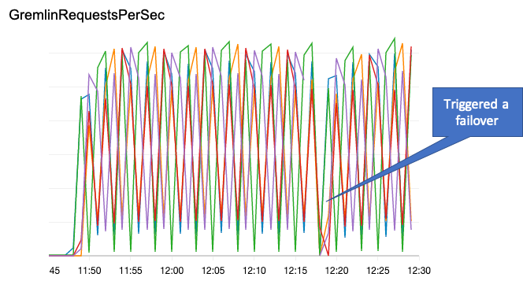

# Gremlin Client for Amazon Neptune

A Java Gremlin client for Amazon Neptune that allows you to change the endpoints used by the client as it is running. Includes an agent that can query the Amazon Neptune API for cluster details, and update the client on a periodic basis. You can supply your own custom endpoint selectors to configure the client for a subset of instances in your cluster based on tags, instance types, instance IDs, AZs, etc.

The client also provides support for IAM database authentication, and for connecting to Neptune via a network or application load balancer.

The Amazon CloudWatch screenshot below shows requests being distributed over 5 instances in a Neptune cluster. The cluster endpoints are being rotated in the client every minute, with 3 endpoints active at any one time. Partway through the run, we deliberately triggered a failover in the cluster.



## Using the topology aware cluster and client
 
You create a `GremlinCluster` and `GremlinClient` much as you would a normal cluster and client:

```
GremlinCluster cluster = NeptuneGremlinClusterBuilder.build()
        .enableSsl(true)
        .addContactPoints("replica-endpoint-1", "replica-endpoint-2", "replica-endpoint-3")
        .port(8182)
        .create();       
 
GremlinClient client = cluster.connect();
 
DriverRemoteConnection connection = DriverRemoteConnection.using(client);
GraphTraversalSource g = AnonymousTraversalSource.traversal().withRemote(connection);
 
// Use g throughout the lifetime of your application to submit queries to Neptune
 
client.close();
cluster.close();
```
 
Use the `GraphTraversalSource` created here throughout the lifetime of your application, and across threads – just as you would with a regular client. The `GremlinClient` ensures that requests are distributed across the current set of endpoints in a round-robin fashion.
 
The `GremlinClient` has a `refreshEndpoints()` method that allows you to submit a fresh list of endpoint addresses. When the list of endpoints changes, new requests will be distributed across the new set of endpoints.
 
Once you have a reference to a `GremlinClient`, you can call this `refreshEndpoints()` method whenever you discover the cluster topology has changed. You could subscribe to SNS events, for example, and refresh the list whenever an instance is added or removed, or when you detect a failover. To update the list of endpoint addresses:
 
```
client.refreshEndpoints("new-replica-endpoint-1", "new-replica-endpoint-2", "new-replica-endpoint-3")
```
 
Because the cluster topology can change at any moment as a result of both planned and unplanned events, you should wrap all queries with an exception handler. Should a query fail because the underlying client connection has been closed, you can attempt a retry.

## ClusterEndpointsRefreshAgent

The `ClusterEndpointsRefreshAgent` allows you to schedule endpoint updates to a client based on a Neptune cluster ID.  The identity under which you're running the agent must be authorized to perform `rds:DescribeDBClusters`,  `rds:DescribeDBInstances` and `rds:ListTagsForResource` for your Neptune cluster.

The following shows how to refresh a client with a cluster's available replica endpoints every 60 seconds:

```
ClusterEndpointsRefreshAgent refreshAgent = new ClusterEndpointsRefreshAgent(
    clusterId,
    ClusterTopologyRefreshAgent.EndpointsType.ReadReplicas);

GremlinCluster cluster = GremlinClusterBuilder.build()
    .enableSsl(true)
    .addContactPoints(refreshAgent.getAddresses())
    .port(8182)
    .create();

GremlinClient client = cluster.connect();

refreshAgent.startPollingNeptuneAPI(
    client::refreshEndpoints,
    60,
    TimeUnit.SECONDS);
```

### EndpointsSelector

The `ClusterEndpointsRefreshAgent` constructor accepts an `EndpointsSelector` that allows you to add custom endpoint selection logic. The following example shows how to select endpoints for all **Available** instances with a **workload** tag whose value is **analytics**:

```
EndpointsSelector selector = (primaryId, replicaIds, instances) → {
    return instances.values().stream()
        .filter(i -> i.hasTag("workload", "analytics"))
        .filter(NeptuneInstanceProperties::isAvailable)
        .map(NeptuneInstanceProperties::getEndpoint)
        .collect(Collectors.toList());
};

ClusterEndpointsRefreshAgent refreshAgent = new ClusterEndpointsRefreshAgent(
    clusterId,
    selector);

GremlinCluster cluster = GremlinClusterBuilder.build()
    .enableSsl(true)
    .addContactPoints(refreshAgent.getAddresses())
    .port(8182)
    .create();

GremlinClient client = cluster.connect();

refreshAgent.startPollingNeptuneAPI(
    client::refreshEndpoints,
    60,
    TimeUnit.SECONDS);
```

The `ClusterEndpointsRefreshAgent.EndpointsType` enum provides implementations of `EndpointsSelector` for selecting all available instances (primary and read replicas), the current primary (if it is available), or all available read replicas.

## GremlinClusterBuilder and NeptuneGremlinClusterBuilder

The library includes two cluster builders: `GremlinClusterBuilder` and `NeptuneGremlinClusterBuilder`. `GremlinClusterBuilder` should work with any Gremlin server. You can also use `GremlinClusterBuilder` if you don't use IAM database authentication or a load balancer with your Neptune database.

If you do use IAM database authentication and/or a network or application load balancer, use the `NeptuneGremlinClusterBuilder` instead. This includes additional builder methods for enabling IAM auth (i.e. Sig4 signing of requests) and adding load balancer endpoints and port details:

```
GremlinCluster cluster = NeptuneGremlinClusterBuilder.build()
        .enableSsl(true)
        .enableIamAuth(true)
        .addContactPoint(neptuneClusterEndpoint)
        .networkLoadBalancerEndpoint(networkLoadBalancerEndpoint)
        .create();
```

If you are using a load balancer or a proxy server (such as HAProxy), you must use SSL termination and have your own SSL certificate on the proxy server. SSL passthrough doesn't work because the provided SSL certificates don't match the proxy server hostname. Note that the Network Load Balancer, although a Layer 4 load balancer, now supports [TLS termination](https://aws.amazon.com/blogs/aws/new-tls-termination-for-network-load-balancers/).

If you have IAM database authentication enabled for your Neptune database, you _must_ set the **SERVICE_REGION** environment variable before connecting from your client – e.g. `export SERVICE_REGION=us-east-1`.

## Demos
 
The demo includes two sample scenarios:
 
### RollingSubsetOfEndpointsDemo
 
Create a Neptune cluster with 2 or more instances and supply the instance endpoints to the demo using the `--endpoint` parameter:
 
```
java -jar gremlin-client-demo.jar rolling-endpoints-demo \
  --enable-ssl \
  --endpoint <my-primary-endpoint> \
  --endpoint <my-replica-endpoint-1> \
  --endpoint <my-replica-endpoint-2>
```
 
When the demo runs, the `GremlinClient` is initialized with approximately two thirds of the endpoints in the cluster (1 endpoint in a 2 instance cluster, 2 endpoints in a 3 instance cluster, 3 endpoints in a 5 instance cluster, etc). The demo repeatedly issues simple queries against the cluster via these endpoints. (It doesn't do anything with the query results – you just see some feedback every 10,000 queries.) Every minute, the demo rolls the endpoints to use a different subset of endpoints.
 
You can view the distribution of queries across the cluster using the Gremlin Requests/Sec CloudWatch metric from the Gremlin console.
 
### RefreshAgentDemo
 
This demo uses a `ClusterTopologyRefreshAgent` to query the Neptune APIs for the current cluster topology every 15 seconds. The `GremlinClient` adapts accordingly.
 
The command for this demo requires a `--cluster-id` parameter. The identity under which you're running the demo must be authorized to perform `rds:DescribeDBClusters`,  `rds:DescribeDBInstances` and `rds:ListTagsForResource` for your Neptune cluster.
 
```
java -jar gremlin-client-demo.jar refresh-agent-demo \
  --enable-ssl \
  --cluster-id <my-cluster-id>
```
 
With this demo, try triggering a failover in the cluster. After approx 15 seconds you should see a new endpoint added to the client, and the old endpoint removed. While the failover is occurring, you may see some queries fail: I've used a simple exception handler to log these errors.
 