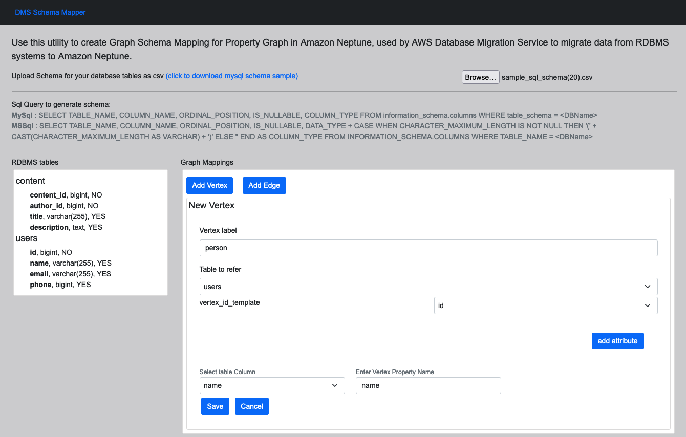
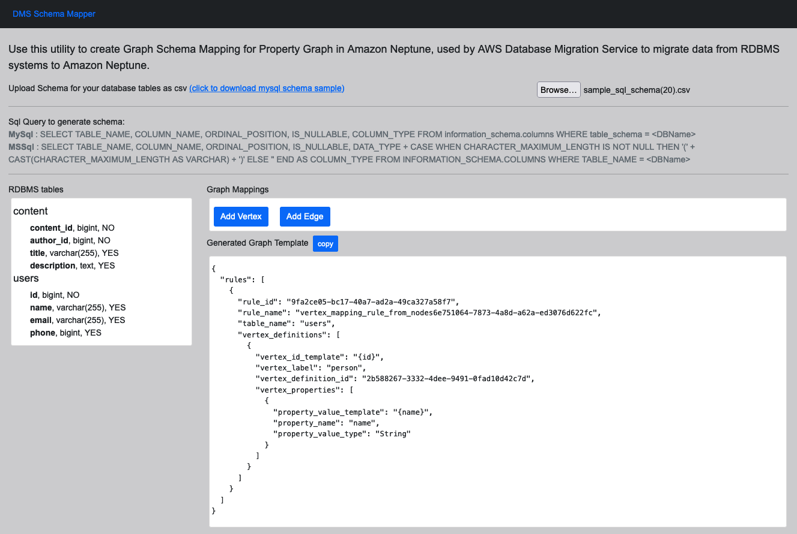
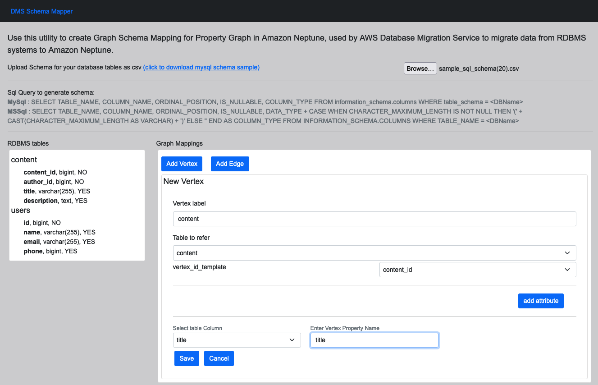
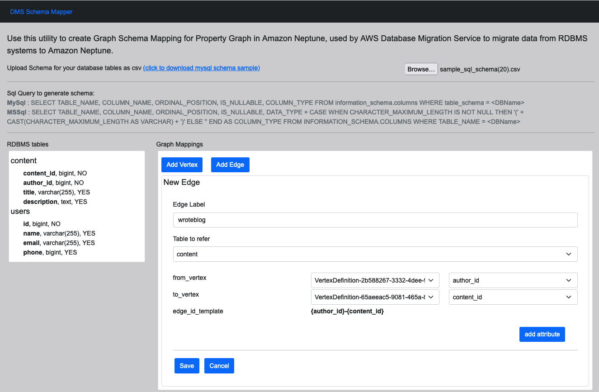

# Neptune DMS SchemaMapping Generation Tool
Install node and npm

Download yarn package manager

Download the tool and run 

```
npm install

run yarn start

```











### Project backlog:

1. Reset Button
2. Save History
3. Visualize model generated
4. Generate ETL scripts


